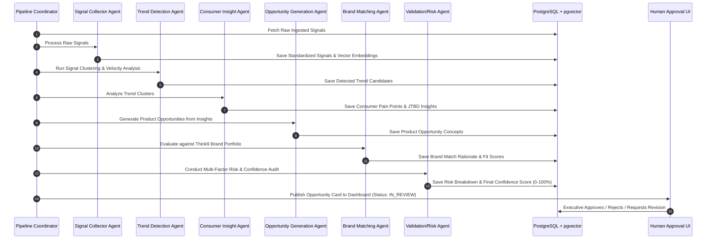

# THINK9 PULSE: System Architecture & Design Specification
**Agentic Consumer Intelligence & Opportunity Engine**
*For the Think9 AI & Intelligence Challenge (Track: Central Consumer Intelligence Engine)*

---

## 1. Executive Summary & Vision

**Think9 Pulse** is an enterprise-grade agentic consumer intelligence engine designed to centralize trend discovery, consumer insight extraction, product opportunity generation, and brand portfolio matching across Think9's 30+ consumer brands.

Rather than relying on reactive market research or fragmented brand-level discovery, Think9 Pulse operates as an autonomous, multi-agent intelligence pipeline. It continuously ingests unstructured consumer signals, detects high-velocity macro/micro trends, extracts underlying consumer pain points, crafts targeted product opportunities, maps them to the optimal Think9 brand, assesses multi-dimensional business risks, and presents validated Opportunity Cards for executive human approval.

### Core Pipeline Architecture

```
 External Consumer Signals (Social, Search, Reviews, News, Competitor Products)
                                  ↓
                      [ 1. Data Ingestion ]
                                  ↓
                   [ 2. Signal Collector Agent ]
                                  ↓
                   [ 3. Trend Detection Agent ]
                                  ↓
                    [ 4. Consumer Insight Agent ]
                                  ↓
               [ 5. Opportunity Generation Agent ]
                                  ↓
                   [ 6. Brand Matching Agent ]
                                  ↓
               [ 7. Risk / Confidence Validation Agent ]
                                  ↓
                      [ 8. Human Approval ]
                                  ↓
                      Actionable Brand Opportunity
```

---

## 2. Architectural Principles

1. **Autonomous Agentic Workflow**: Multi-step reasoning where specialized agents perform distinct analytical tasks with explicit input/output contracts.
2. **Strict Explainability & Evidence Lineage**: Every opportunity carries a verifiable audit trail linking back to individual raw signals, sentiment metrics, and agent reasoning steps.
3. **Structured Outputs & Schema Safety**: All AI interactions utilize Pydantic schemas enforced via Gemini API's structured output mode (`response_mime_type="application/json"`).
4. **Human-in-the-Loop Governance**: AI generates, validates, and recommends; human executives retain decision authority (Approve, Reject, Revise, Assign).
5. **Separation of Real & Simulated Data**: Clean isolation between simulated demo datasets and external data connector interfaces.
6. **Enterprise Design Standard**: High-density business intelligence UI using clean modern typography, metric cards, radar charts, and clear hierarchy—avoiding generic chatbot UI paradigms.

---

## 3. System Architecture & Component Diagram

```
+-----------------------------------------------------------------------------------+
|                                  NEXT.JS FRONTEND                                 |
|  +-------------------+  +--------------------+  +------------------------------+  |
|  | Executive Dashboard|  | Opportunity Workbench|  | Agent Pipeline Visualizer    |  |
|  +-------------------+  +--------------------+  +------------------------------+  |
|  | Trend Radar       |  | Brand Portfolio Hub|  | Signal Feed & Analytics      |  |
|  +-------------------+  +--------------------+  +------------------------------+  |
+------------------------------------------|----------------------------------------+
                                           | HTTP / REST API (JSON)
                                           v
+-----------------------------------------------------------------------------------+
|                                  FASTAPI BACKEND                                  |
|  +-----------------------------------------------------------------------------+  |
|  | API Router (/opportunities, /trends, /brands, /signals, /pipeline)           |  |
|  +-----------------------------------------------------------------------------+  |
|  | Pipeline Coordinator & State Machine (Orchestrator)                         |  |
|  +-----------------------------------------------------------------------------+  |
|  | Agent Execution Suite (Gemini 2.5/1.5 API Integration)                      |  |
|  |   - SignalCollectorAgent                                                    |  |
|  |   - TrendDetectionAgent                                                     |  |
|  |   - ConsumerInsightAgent                                                    |  |
|  |   - OpportunityGenerationAgent                                              |  |
|  |   - BrandMatchingAgent                                                      |  |
|  |   - ValidationRiskAgent                                                     |  |
|  +-----------------------------------------------------------------------------+  |
|  | Vector & Semantic Retrieval Engine (pgvector embeddings)                    |  |
|  +-----------------------------------------------------------------------------+  |
+------------------------------------------|----------------------------------------+
                                           | SQL / Vector Search
                                           v
+-----------------------------------------------------------------------------------+
|                              POSTGRESQL + PGVECTOR DB                             |
|  Tables: brands, raw_signals, signals, trends, insights, opportunities,          |
|          brand_matches, risk_validations, agent_logs                              |
+-----------------------------------------------------------------------------------+
```

---

## 4. Major Components & Responsibilities

### 4.1 Frontend (`frontend/`)
- **Technology**: Next.js 14+ (App Router), React 18, TypeScript, Tailwind CSS, shadcn/ui, Recharts, Framer Motion.
- **Responsibilities**:
  - Render executive dashboards showing high-impact emerging consumer opportunities.
  - Interactive Opportunity Workbench displaying confidence scores, evidence traces, brand match rationale, risk radar charts, and approval controls.
  - Trend discovery radar & category velocity visualization.
  - Live agent pipeline monitoring view with real-time execution logs.

### 4.2 Backend Engine (`backend/`)
- **Technology**: Python 3.11+, FastAPI, AsyncIO, Pydantic v2, SQLAlchemy / SQLModel.
- **Responsibilities**:
  - Expose RESTful API endpoints for frontend consumption.
  - Orchestrate sequential multi-agent execution pipeline.
  - Manage database sessions and vector embeddings operations.
  - Provide asynchronous trigger endpoints for pipeline runs.

### 4.3 Agent Suite (`agents/`)
- **Technology**: Google Gemini API (`google-genai` SDK / Pydantic models).
- **Core Agents**:
  1. **Signal Collector Agent**: Cleanses raw multi-channel signals (social, reviews, search, news), extracts keywords, assigns sentiment/velocity weights, and generates text embeddings.
  2. **Trend Detection Agent**: Clusters semantically related signals, computes volume acceleration and cross-platform reach to detect emerging macro/micro trends.
  3. **Consumer Insight Agent**: Analyzes trend clusters to identify core consumer pain points, Jobs-to-Be-Done (JTBD), unaddressed market needs, and emotional triggers.
  4. **Opportunity Generation Agent**: Synthesizes insights into concrete product concepts including product specs, target price tier, positioning statement, and core feature set.
  5. **Brand Matching Agent**: Evaluates the opportunity against Think9's 30+ brand portfolio based on category alignment, brand equity, price positioning, and supply chain synergy.
  6. **Risk / Confidence Validation Agent**: Performs a multi-factorial risk audit (regulatory, competitive, supply chain, margin viability) and computes the overall Opportunity Confidence Score (0-100%).

### 4.4 Data & Storage Layer (`database/` & `data/`)
- **Technology**: PostgreSQL 15+ with `pgvector` extension.
- **Responsibilities**:
  - Store structured entities (Brands, Signals, Trends, Insights, Opportunities, Risk Reports, Audit Logs).
  - Perform vector similarity search to link related signals to new trend clusters.
  - House representative/simulated datasets for Think9 brand profiles, consumer signals, reviews, and market trends.

---

## 5. Data Flow & Pipeline Execution Mechanics



---

## 6. Database Entity-Relationship (ER) Schema

```sql
-- Enable Vector Extension
CREATE EXTENSION IF NOT EXISTS vector;

-- 1. Think9 Brands Table
CREATE TABLE brands (
    id UUID PRIMARY KEY DEFAULT gen_random_uuid(),
    name VARCHAR(100) NOT NULL,
    category VARCHAR(100) NOT NULL,
    target_audience TEXT NOT NULL,
    price_tier VARCHAR(50) NOT NULL, -- Budget, Premium, Ultra-Premium, Masstige
    positioning TEXT NOT NULL,
    brand_values JSONB NOT NULL,
    created_at TIMESTAMP WITH TIME ZONE DEFAULT CURRENT_TIMESTAMP
);

-- 2. Raw Signals Table
CREATE TABLE raw_signals (
    id UUID PRIMARY KEY DEFAULT gen_random_uuid(),
    source_type VARCHAR(50) NOT NULL, -- social, review, search_trend, news, retail
    title VARCHAR(255),
    content TEXT NOT NULL,
    author_or_channel VARCHAR(100),
    url TEXT,
    timestamp TIMESTAMP WITH TIME ZONE NOT NULL,
    raw_metadata JSONB DEFAULT '{}'::jsonb,
    created_at TIMESTAMP WITH TIME ZONE DEFAULT CURRENT_TIMESTAMP
);

-- 3. Processed Signals Table (With Embeddings)
CREATE TABLE signals (
    id UUID PRIMARY KEY DEFAULT gen_random_uuid(),
    raw_signal_id UUID REFERENCES raw_signals(id) ON DELETE CASCADE,
    category VARCHAR(100) NOT NULL,
    summary TEXT NOT NULL,
    sentiment_score FLOAT NOT NULL, -- -1.0 to +1.0
    velocity_weight FLOAT NOT NULL, -- 0.0 to 1.0
    keywords TEXT[] DEFAULT '{}',
    embedding vector(768), -- Embedding vector for semantic retrieval
    processed_at TIMESTAMP WITH TIME ZONE DEFAULT CURRENT_TIMESTAMP
);

-- 4. Trends Table
CREATE TABLE trends (
    id UUID PRIMARY KEY DEFAULT gen_random_uuid(),
    title VARCHAR(255) NOT NULL,
    category VARCHAR(100) NOT NULL,
    description TEXT NOT NULL,
    momentum_score FLOAT NOT NULL, -- 0-100
    growth_rate_pct FLOAT NOT NULL,
    cross_platform_reach VARCHAR(50) NOT NULL, -- Low, Medium, High, Explosive
    status VARCHAR(50) DEFAULT 'EMERGING', -- EMERGING, PEAKING, DECLINING
    signal_count INT DEFAULT 0,
    created_at TIMESTAMP WITH TIME ZONE DEFAULT CURRENT_TIMESTAMP
);

-- 5. Trend Signal Mapping
CREATE TABLE trend_signal_mapping (
    trend_id UUID REFERENCES trends(id) ON DELETE CASCADE,
    signal_id UUID REFERENCES signals(id) ON DELETE CASCADE,
    relevance_score FLOAT NOT NULL,
    PRIMARY KEY (trend_id, signal_id)
);

-- 6. Consumer Insights Table
CREATE TABLE insights (
    id UUID PRIMARY KEY DEFAULT gen_random_uuid(),
    trend_id UUID REFERENCES trends(id) ON DELETE CASCADE,
    title VARCHAR(255) NOT NULL,
    pain_points JSONB NOT NULL, -- Array of pain point objects
    jtbd_summary TEXT NOT NULL, -- Jobs-To-Be-Done
    target_demographics JSONB NOT NULL,
    evidence_summary TEXT NOT NULL,
    sentiment_drivers JSONB NOT NULL,
    created_at TIMESTAMP WITH TIME ZONE DEFAULT CURRENT_TIMESTAMP
);

-- 7. Opportunities Table
CREATE TABLE opportunities (
    id UUID PRIMARY KEY DEFAULT gen_random_uuid(),
    insight_id UUID REFERENCES insights(id) ON DELETE CASCADE,
    title VARCHAR(255) NOT NULL,
    product_concept TEXT NOT NULL,
    target_price_range VARCHAR(100) NOT NULL,
    core_features JSONB NOT NULL, -- Array of feature strings
    value_proposition TEXT NOT NULL,
    recommended_positioning TEXT NOT NULL,
    recommended_next_action TEXT NOT NULL,
    status VARCHAR(50) DEFAULT 'IN_REVIEW', -- IN_REVIEW, APPROVED, REJECTED, REVISION_REQUESTED
    human_notes TEXT,
    created_at TIMESTAMP WITH TIME ZONE DEFAULT CURRENT_TIMESTAMP,
    updated_at TIMESTAMP WITH TIME ZONE DEFAULT CURRENT_TIMESTAMP
);

-- 8. Brand Matches Table
CREATE TABLE brand_matches (
    id UUID PRIMARY KEY DEFAULT gen_random_uuid(),
    opportunity_id UUID REFERENCES opportunities(id) ON DELETE CASCADE,
    primary_brand_id UUID REFERENCES brands(id),
    fit_score FLOAT NOT NULL, -- 0-100
    fit_rationale TEXT NOT NULL,
    strategic_alignment TEXT NOT NULL,
    cannibalization_risk TEXT NOT NULL,
    alternative_brand_ids JSONB DEFAULT '[]'::jsonb,
    created_at TIMESTAMP WITH TIME ZONE DEFAULT CURRENT_TIMESTAMP
);

-- 9. Risk & Confidence Validations Table
CREATE TABLE risk_validations (
    id UUID PRIMARY KEY DEFAULT gen_random_uuid(),
    opportunity_id UUID REFERENCES opportunities(id) ON DELETE CASCADE,
    overall_confidence_score FLOAT NOT NULL, -- 0-100
    regulatory_risk_score FLOAT NOT NULL, -- 0-100 (lower is safer)
    competitive_risk_score FLOAT NOT NULL,
    supply_chain_risk_score FLOAT NOT NULL,
    margin_risk_score FLOAT NOT NULL,
    risk_factors JSONB NOT NULL, -- Array of risk items with severity
    mitigation_strategies JSONB NOT NULL,
    audit_summary TEXT NOT NULL,
    created_at TIMESTAMP WITH TIME ZONE DEFAULT CURRENT_TIMESTAMP
);

-- 10. Agent Execution Logs (Audit Trail)
CREATE TABLE agent_logs (
    id UUID PRIMARY KEY DEFAULT gen_random_uuid(),
    pipeline_run_id UUID NOT NULL,
    agent_name VARCHAR(100) NOT NULL,
    opportunity_id UUID REFERENCES opportunities(id) ON DELETE CASCADE,
    input_summary TEXT NOT NULL,
    output_summary TEXT NOT NULL,
    reasoning_chain JSONB NOT NULL,
    prompt_tokens INT DEFAULT 0,
    completion_tokens INT DEFAULT 0,
    execution_time_ms INT NOT NULL,
    status VARCHAR(50) DEFAULT 'SUCCESS',
    created_at TIMESTAMP WITH TIME ZONE DEFAULT CURRENT_TIMESTAMP
);
```

---

## 7. Agent Input/Output Contracts & Schemas

All agent contracts are defined as Python Pydantic classes and passed to Gemini API for structured JSON extraction.

### 7.1 Signal Collector Agent
- **Input**: `RawSignalPayload(source_type, title, content, author_or_channel, url, timestamp)`
- **Output Schema**:
  ```python
  class ProcessedSignalOutput(BaseModel):
      category: str  # e.g., "Food & Beverage", "Personal Care", "Wellness"
      summary: str
      sentiment_score: float  # -1.0 to 1.0
      velocity_weight: float  # 0.0 to 1.0 based on engagement/shares
      keywords: list[str]
      intent_type: str  # "Pain Point", "Feature Request", "Unmet Demand", "Brand Praise"
  ```

### 7.2 Trend Detection Agent
- **Input**: `list[ProcessedSignalOutput]` + existing trend database
- **Output Schema**:
  ```python
  class TrendDetectionOutput(BaseModel):
      trend_title: str
      category: str
      description: str
      momentum_score: float  # 0 to 100
      growth_rate_pct: float
      cross_platform_reach: str  # "Low", "Medium", "High", "Explosive"
      contributing_signal_indices: list[int]
      trend_longevity: str  # "Fad", "Seasonal", "Macro Trend", "Permanent Shift"
  ```

### 7.3 Consumer Insight Agent
- **Input**: `TrendDetectionOutput` + related signal details
- **Output Schema**:
  ```python
  class PainPoint(BaseModel):
      description: str
      severity: str  # "Low", "Medium", "High", "Critical"
      frequency_mention: str

  class ConsumerInsightOutput(BaseModel):
      insight_title: str
      pain_points: list[PainPoint]
      jtbd_summary: str  # Jobs-to-be-done statement
      target_demographics: list[str]
      emotional_triggers: list[str]
      evidence_summary: str
  ```

### 7.4 Opportunity Generation Agent
- **Input**: `ConsumerInsightOutput`
- **Output Schema**:
  ```python
  class ProductOpportunityOutput(BaseModel):
      opportunity_title: str
      product_concept: str
      target_price_range: str  # e.g., "$15 - $25"
      core_features: list[str]
      value_proposition: str
      recommended_positioning: str
      recommended_next_action: str
  ```

### 7.5 Brand Matching Agent
- **Input**: `ProductOpportunityOutput` + `list[Think9BrandProfile]`
- **Output Schema**:
  ```python
  class BrandMatchOutput(BaseModel):
      primary_brand_name: str
      fit_score: float  # 0 to 100
      fit_rationale: str
      strategic_alignment: str
      cannibalization_risk: str
      alternative_brands: list[str]
  ```

### 7.6 Risk / Confidence Validation Agent
- **Input**: All previous agent outputs combined
- **Output Schema**:
  ```python
  class RiskFactor(BaseModel):
      category: str  # "Regulatory", "Competitive", "Supply Chain", "Financial"
      risk_level: str  # "Low", "Medium", "High"
      description: str

  class ValidationRiskOutput(BaseModel):
      overall_confidence_score: float  # 0 to 100
      regulatory_risk_score: float
      competitive_risk_score: float
      supply_chain_risk_score: float
      margin_risk_score: float
      risk_factors: list[RiskFactor]
      mitigation_strategies: list[str]
      validation_summary: str
  ```

---

## 8. API Specifications (FastAPI)

### 8.1 Opportunities Endpoints
- `GET /api/v1/opportunities`
  - **Query Params**: `status` (IN_REVIEW, APPROVED, REJECTED), `category`, `brand_id`, `min_confidence`
  - **Response**: List of Opportunity Cards with summary stats.
- `GET /api/v1/opportunities/{id}`
  - **Response**: Complete detailed Opportunity Card including evidence signal list, brand match report, risk radar breakdown, and full agent audit logs.
- `POST /api/v1/opportunities/{id}/approve`
  - **Body**: `{ "notes": "Approved for Q4 product roadmap", "assigned_brand_lead": "sarah.chen@think9.ai" }`
  - **Response**: Updated opportunity status (`APPROVED`).
- `POST /api/v1/opportunities/{id}/reject`
  - **Body**: `{ "reason": "Margin profile too low given current supply costs" }`
  - **Response**: Updated opportunity status (`REJECTED`).

### 8.2 Pipeline & Signal Endpoints
- `POST /api/v1/pipeline/run`
  - **Body**: `{ "demo_scenario": "High-Protein Breakfast", "signal_count": 25 }`
  - **Response**: `{ "pipeline_run_id": "...", "status": "COMPLETED", "generated_opportunity_id": "..." }`
- `GET /api/v1/trends`
  - **Response**: List of detected trends, momentum scores, and growth vectors.
- `GET /api/v1/brands`
  - **Response**: Think9 portfolio brand list with matching stats and active opportunities.
- `GET /api/v1/signals`
  - **Response**: Feed of ingested raw and processed signals with sentiment distribution.

---

## 9. Frontend Application Architecture & UI Routes

The frontend follows a modern, dark-mode-first, enterprise business intelligence layout built with Next.js 14 App Router and shadcn/ui.

```
frontend/src/app/
├── (dashboard)/
│   ├── page.tsx                  --> Executive Intelligence Overview (KPIs, Top Opportunities, Trend Radar)
│   ├── opportunities/
│   │   ├── page.tsx              --> Opportunity Feed with Filters (Grid & Table View)
│   │   └── [id]/
│   │       └── page.tsx          --> Deep-Dive Opportunity Workbench & Human Approval Portal
│   ├── trends/
│   │   └── page.tsx              --> Trend Momentum Matrix & Category Heatmap
│   ├── brands/
│   │   └── page.tsx              --> Think9 Brand Portfolio Intelligence
│   ├── signals/
│   │   └── page.tsx              --> Signal Ingestion Feed & Sentiment Stream
│   └── pipeline/
│       └── page.tsx              --> Visual Agent Execution & Audit Trail
└── layout.tsx
```

---

## 10. Demo Scenario: "High-Protein Breakfast" Trace

To showcase the system during evaluation, Think9 Pulse pre-packages a flagship representative scenario:

1. **Signals Ingested**:
   - Reddit post in `r/nutrition`: *"Tired of sweet protein shakes in the morning, wish there was a savory high-protein breakfast bite with 25g protein."*
   - Amazon Review on rival brand: *"Product tastes okay but full of artificial gums and takes 10 mins to prep."*
   - Google Search Trend data: +140% YoY spike for *"savory quick high protein breakfast"*.
   - TikTok hashtag analytics: `#highproteinbreakfast` reaching 45M views, leaning towards quick savory prep.
2. **Trend Detected**: *"Savory High-Protein Quick Morning Formats"* (Momentum: 88/100, Growth: +140%).
3. **Consumer Insight**: Consumers demand 25g+ protein, under 3-minute prep, clean label (no artificial gums), savory flavor profile (egg/herb/cheese) to combat sweet fatigue.
4. **Opportunity Generated**: *"ProBite Savory Protein Egg & Herb Breakfast Squares"* ($18.99 for 6-pack).
5. **Brand Match**: **NutriPulse** (Think9's functional wellness & nutrition brand) - 94% Fit Score.
6. **Risk / Confidence**: Overall Confidence Score: **91%** (Regulatory: 12%, Competitive: 25%, Supply Chain: 15%, Margin: 18%).
7. **Human Approval**: Executive clicks **"Approve & Dispatch to NutriPulse R&D"**.

---

## 11. Security, Resilience & Scalability

1. **API Key Security**: Server-side API key retrieval via `os.getenv("GEMINI_API_KEY")`. Zero API exposure to browser clients.
2. **Graceful Fallbacks & Retry**: Retries with exponential backoff on Gemini API rate limits (`google-genai` exception handling).
3. **Input Validation**: Strict request/response validation using FastAPI and Pydantic schemas.
4. **Simulated Data Boundaries**: Simulated datasets are marked with explicit metadata tags (`is_simulated=True`) to prevent contamination with future production data streams.
